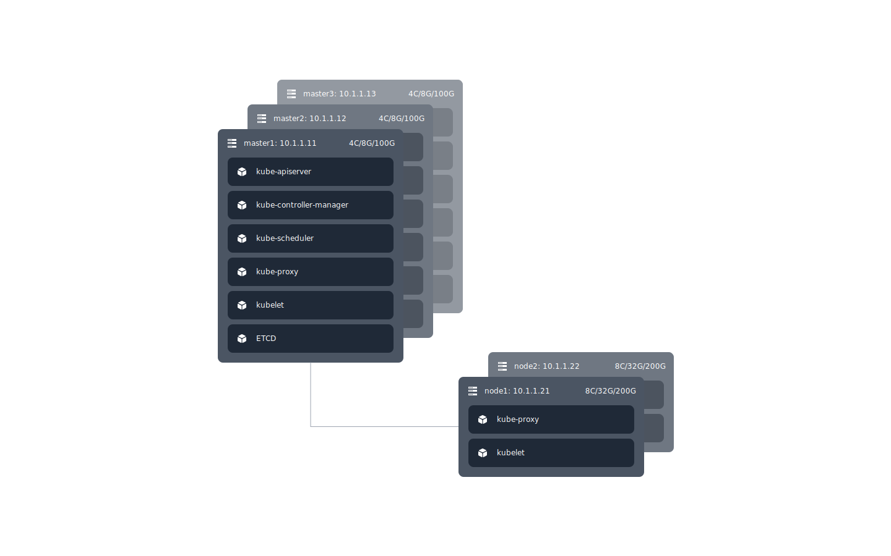

# 集群规划

## 部署架构

### 部署架构图

### 环境信息

| 主机名称 | IP        | 配置        | 角色          | 组件                                                                          |
| -------- | --------- | ----------- | ------------- | ----------------------------------------------------------------------------- |
| master1  | 10.1.1.11 | 4C/8G/100G  | control-plane | kube-apiserver,kube-controller-manager,kube-scheduler,kube-proxy,kubelet,ETCD |
| master2  | 10.1.1.12 | 4C/8G/100G  | control-plane | kube-apiserver,kube-controller-manager,kube-scheduler,kube-proxy,kubelet,ETCD |
| master3  | 10.1.1.13 | 4C/8G/100G  | control-plane | kube-apiserver,kube-controller-manager,kube-scheduler,kube-proxy,kubelet,ETCD |
| node1    | 10.1.1.21 | 8C/32G/200G | worker-node   | kube-proxy,kubelet                                                            |
| node2    | 10.1.1.22 | 8C/32G/200G | worker-node   | kube-proxy,kubelet                                                            |

## 后续步骤

1. 创建并分发 ETCD、 Kubernetes(kubernetes,kube-apiserver,controller-manager,kube-scheduler,kubeconfig,kube-proxy) 证书
2. 安装 ETCD
3. 安装 Kubernetes 组件 kubelet,kube-apiserver,kube-controller-manager,kube-scheduler,kube-proxy
4. master 节点 HA
5. 安装网络插件
6. 安装 coredns,Metrics Server,openEBS or local-path-provisioner
